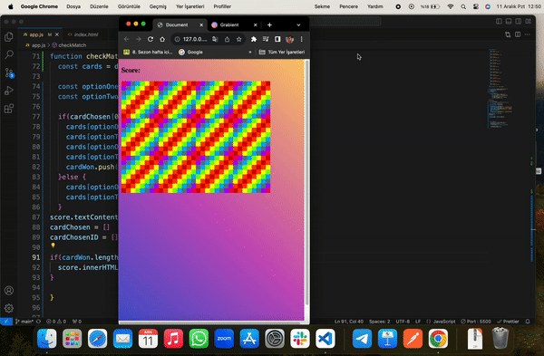

# JavaScript ile Hafıza Oyunu

🃏 JavaScript ile geliştirilmiş basit ve eğlenceli bir hafıza oyununa hoş geldiniz.

## Proje Genel Bakış

Bu proje, 12 kart içeren klasik bir hafıza oyununu içermektedir. Kullanıcının her kartın eşini bulması ve her başarılı eşleşme için 1 puan kazanması amaçlanmıştır.

## Kullanılan Teknolojiler

- **JavaScript:** Oyunun işlevselliğini sağlayan temel programlama dili.
- **HTML/CSS:** Kullanıcı arayüzünü ve tasarımı oluşturan web teknolojileri.

## Nasıl Oynanır

1. Repositoriyi bilgisayarınıza klonlayın.
2. `index.html` dosyasını tercih ettiğiniz web tarayıcısında açın.
3. Kartları simgelerini görmek için kartlara tıklayın.
4. İki kartı aynı anda tıklayarak eşleşen çiftleri bulmaya çalışın.
5. Her başarılı eşleşme size 1 puan kazandırır.
6. Oynamaya devam edin ve hafızanızı geliştirmek için kendinizi zorlayın!

## Proje Yapısı

- `index.html`: Oyunun yapısını içeren ana HTML dosyası.
- `style.css`: Kullanıcı arayüzünü stilize eden CSS dosyası.
- `script.js`: Oyun mantığını uygulayan JavaScript dosyası.

<h3>Ekran Görüntüsü</h3>

